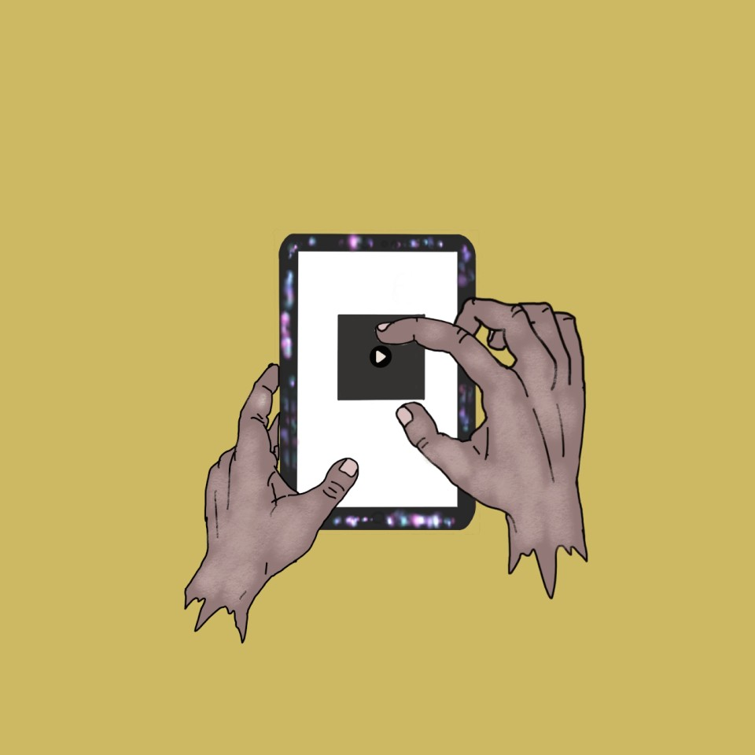

# Lithium Metamorphosis

What is lithium? Why does everybody talk about it? What does it represent?

<table>
<tr>
<td width="30%" valign="middle">
  
</td>
<td width="70%" valign="middle">

We hold it in our hands every day. It sits inside almost every battery on the planet. It carries a myriad of transformations, stories, conceptions and misconceptions, meaning something different depending on who speaks about it, and who comes into contact with it. We, Elena and Matilde, want to unveil the metamorphosis and journey of this material: from its origins and extraction, through assembly, to the batteries we hold every day, and finally to disposal. The story starts in Chile, at Salar de Maricunga: chapter one. An endeavour to tell this journey artistically and engagingly, in both an educational and emotional sense, blending data visualisation, illustration and conversations with the many players inside this complex lithium ecosystem.

</td>
</tr>
</table>